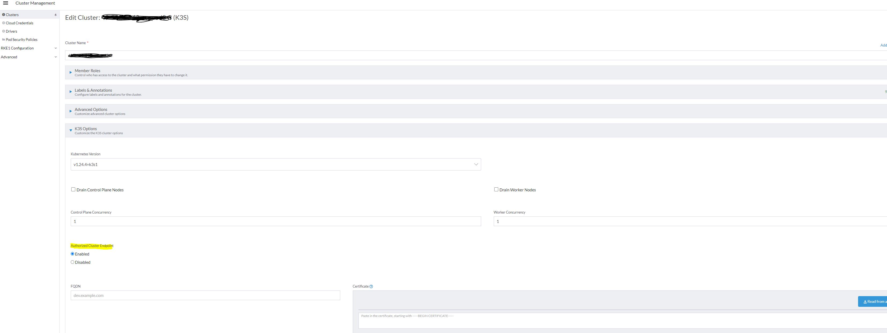
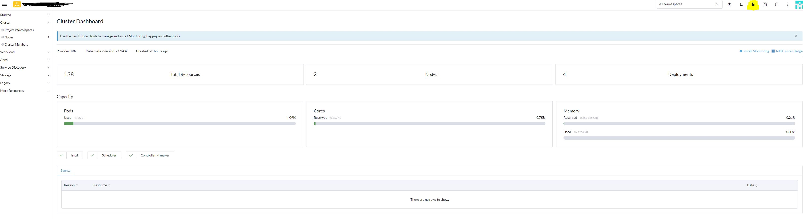

= Collecting different audit logs using logging operator in rancher
:toc:

[bibliography]
== References
* https://ranchermanager.docs.rancher.com/v2.6/reference-guides/rancher-manager-architecture/architecture-recommendations#architecture-for-an-authorized-cluster-endpoint-ace
* https://ranchermanager.docs.rancher.com/v2.6/how-to-guides/advanced-user-guides/enable-api-audit-log
* https://kubernetes.io/docs/tasks/debug/debug-cluster/audit/

== Introduction

In this blog we will focus on **collecting** the different audit logs through logging operator in rancher. 

Using Rancher means that you control you K8s clusters (downstream cluster in rancher terms) using a central rancher server, This means that you simply will be creating/deleting/modifying API objects from rancher UI, this introduce the concern of Audit, simply you want to know who did the modifications.

So Lets give a simple introduction first and then enable and collect audit logs from both central rancher server and also from Kube-api server.

== Source of Audit logs in Rancher

Rancher offer an easy to setup sidecar container that you can enable and it will start to generate your audit logs for any action performed by Rancher UI or even through kubectl as long as your kubectl connect through rancher authentication proxy (for more info please check https://ranchermanager.docs.rancher.com/v2.6/reference-guides/rancher-manager-architecture/communicating-with-downstream-user-clusters[Communicating with Downstream User Clusters]) and rancher API server. For more for regarding Rancher API audit log, check https://ranchermanager.docs.rancher.com/v2.6/how-to-guides/advanced-user-guides/enable-api-audit-log[Enabling the API Audit Log to Record System Events]

But what if you connect directly to downstream cluster, either using ACE or even kubeconfig client certificate ?
Then you need to enable kube-api audit logs.

[NOTE]
====
ACE or Authorized Cluster Endpoint allows you to access your downstream Kubernetes cluster with the kubectl CLI and a kubeconfig file (rancher create for you multiple Kubernetes contexts to access your downstream cluster, either pointing to your lb or your master nodes). In this scenario, the downstream cluster's Kubernetes API server authenticates you by calling a webhook (the kube-api-auth microservice) that Rancher set up. The capability to connect directly to the cluster's Kubernetes API server, is important because it lets you access your downstream cluster if you can't connect to Rancher. 
====

== Rancher Audit Logs

You can enable this log as you would with any container log. Enable logging for the rancher container by setting the helm value.

[source,bash]
----
--set auditLog.level=1
----

so in my case

[source,bash]
----
helm upgrade --install rancher rancher-latest/rancher --namespace cattle-system   --create-namespace   --set hostname=rancher-lab.my-lab.com   --version=2.6.9 --set replicas=1 --set release-namespace="cattle-system" --atomic --set auditLog.level=2
----

then assuming that the https://ranchermanager.docs.rancher.com/v2.6/pages-for-subheaders/logging[rancher-logging] is already installed. 

We will need to create the needed logging https://ranchermanager.docs.rancher.com/v2.6/integrations-in-rancher/logging/custom-resource-configuration/outputs-and-clusteroutputs[Output] 

[source,yaml]
----
apiVersion: v1
kind: Secret
metadata:
  name: rancher-audit-s3
  namespace: cattle-system
type: Opaque
data:
  awsAccessKeyId: xxxx=
  awsSecretAccessKey: xxxx==
---
apiVersion: logging.banzaicloud.io/v1beta1
kind: Output
metadata:
 name: rancher-audit-s3-output
 namespace: cattle-system
spec:
#https://github.com/banzaicloud/logging-operator/blob/master/charts/logging-operator/crds/logging.banzaicloud.io_outputs.yaml
 s3:
   aws_key_id:
     valueFrom:
       secretKeyRef:
         name: rancher-audit-s3
         key: awsAccessKeyId
   aws_sec_key:
     valueFrom:
       secretKeyRef:
         name: rancher-audit-s3
         key: awsSecretAccessKey
   s3_bucket: rancher-sample-logging
   s3_region: eu-central-1
   path: logs/${tag}/%Y/%m/%d/
   buffer:
     timekey: 10m
     timekey_wait: 30s
     timekey_use_utc: true
----

and https://ranchermanager.docs.rancher.com/v2.6/integrations-in-rancher/logging/custom-resource-configuration/flows-and-clusterflows[Flow]
[source,yaml]
----
apiVersion: logging.banzaicloud.io/v1beta1
kind: Flow
metadata:
  name: rancher-audit-s3-flow
  namespace: cattle-system (1)
spec:
  filters:
    - tag_normaliser: {}
  match:
    - select:
        container_names : 
          - rancher-audit-log (2)
  localOutputRefs:
    - rancher-audit-s3-output
----
(1) Both Output and flow are deployed to the cattle-system ns, which contain the rancher Pod.
(2) Select only the rancher-audit-log container.

This will collect your rancher audit logs and forward them to S3 for archiving 

== Enable ACE on K3s
Although it is not is the scope of this blog but quickly lets enable ACE on a downstream K3s cluster, You can skip to next section if you want.

. follow https://ranchermanager.docs.rancher.com/v2.6/how-to-guides/new-user-guides/kubernetes-clusters-in-rancher-setup/register-existing-clusters#authorized-cluster-endpoint-support-for-rke2-and-k3s-clusters[enable ACE on K3s]
.. Create kube-api-authn-webhook.yaml
+
[source,bash]
----
$ sudo cat  <<EOF > /var/lib/rancher/k3s/kube-api-authn-webhook.yaml
apiVersion: v1
kind: Config
clusters:
- name: Default
  cluster:
    insecure-skip-tls-verify: true
    server: http://127.0.0.1:6440/v1/authenticate
users:
- name: Default
  user:
    insecure-skip-tls-verify: true
current-context: webhook
contexts:
- name: webhook
  context:
    user: Default
    cluster: Default
EOF
----
+
.. append the kube-apiserver-arg parameters to config.yaml
+	
[source,bash]
----
$ sudo vi /etc/rancher/k3s/config.yaml
..	
kube-apiserver-arg:
  - authentication-token-webhook-config-file=/var/lib/rancher/k3s/kube-api-authn-webhook.yaml
----
+
then ensure that the api-server started with the new parameters
+
[source,bash]
----
ps -ef | grep kube-apiserver | grep -v grep
----

. From the UI of rancher Cluster Management > Edit Config > RKE Options > Authorized Cluster Endpoint -- check Enabled
+

. Go back to cluster explorer and download the KubeConfig
+

+
then check the available contexts
+
[source,bash]
----
kubectl config get-contexts
----

== Kube-api Audit logs

kube-api is more tricky, as the kube-api will generate the logs in the file system or to stdout according to your config. 

According to https://kubernetes.io/docs/tasks/debug/debug-cluster/audit/#log-backend[Log backend]

> Log backend
> The log backend writes audit events to a file in JSONlines format. You can configure the log audit backend using the following kube-apiserver flags:
>
> --audit-log-path specifies the log file path that log backend uses to write audit events. **Not specifying this flag disables log backend. - means standard out**
> --audit-log-maxage defined the maximum number of days to retain old audit log files
> --audit-log-maxbackup defines the maximum number of audit log files to retain
> --audit-log-maxsize defines the maximum size in megabytes of the audit log file before it gets rotated

So we will take advantage of this and configure the Kube-api audit logs collection according to how kube-api is deployed, if it is 
. Static pod like rke2, we will simply emit the audit-log to stdout 
. OS service like K3s, we will emit the logs to a file

So lets start from the beginning

=== Collect API-server audit logs on K3s

==== Enable API-server audit logs

. follow https://ranchermanager.docs.rancher.com/reference-guides/rancher-security/rancher-v2.6-hardening-guides/rke2-hardening-guide-with-cis-v1.6-benchmark#api-server-audit-configuration[enable audit-logs for API-server]

.. Create audit-policy.yaml file, for more info regarding Policy file check https://kubernetes.io/docs/tasks/debug/debug-cluster/audit/#audit-policy[K8s Audit policy]
+
[source,bash]
----
$ sudo cat  <<EOF > /etc/rancher/k3s/audit-policy.yaml
apiVersion: audit.k8s.io/v1
kind: Policy
rules:
- level: None
  verbs: ["get", "watch", "list"]

- level: None
  resources:
  - group: "" # core
    resources: ["events"]

- level: None
  users:
  - "system:kube-scheduler"
  - "system:kube-proxy"
  - "system:apiserver"
  - "system:kube-controller-manager"

- level: None
  userGroups: ["system:nodes"]

- level: RequestResponse
EOF
----
+
.. append the kube-apiserver-arg parameters to config.yaml
+	
[source,bash]
----
$ sudo  vi /etc/rancher/k3s/config.yaml
..
kube-apiserver-arg:
  - audit-policy-file=/etc/rancher/k3s/audit-policy.yaml <1>
  - audit-log-path=/var/lib/rancher/k3s/server/logs/audit.log <2>
  - audit-log-maxage=30
  - audit-log-maxbackup=10
  - audit-log-maxsize=100
  ...
----
<1> The audit Policy file you created in previous step
<2> The location on the file system, where the logs will be generated 

==== Collect audit log from file
Here is the magic, as very little documentation on the internet around this one. So rancher-logging have a very interesting feature named kubeAudit.
If you enable kubeAudit logging in the rancher-logging app, it will create the rancher-logging-kube-audit-fluentbit DaemonSet running on master/controlplane nodes. It is mainly for grabbing the logs generated from kube-api using https://docs.fluentbit.io/manual/pipeline/inputs/tail[inputTail plugin]

. We will need to ensure that we enable & configure the kubeAudit during the installation of the rancher-logging. If rancher-logging is already installed then edit it to enable kubeAudit. 
+
[source,yaml]
----
      kubeAudit:
        auditFilename: 'audit.log' <1>
        enabled: true <2>
        fluentbit:
          logTag: kube-audit
          tolerations:
            - effect: NoSchedule
              key: node-role.kubernetes.io/controlplane
              value: 'true'
            - effect: NoExecute
              key: node-role.kubernetes.io/etcd
              value: 'true'
        pathPrefix: '/var/lib/rancher/k3s/server/logs' <3>
----
<1> The audit file should match the one defined in the kube-apiserver-arg created ibn previous step
<2> Enable, it is disabled by default  
<3> The audit path should match the one defined in the kube-apiserver-arg created ibn previous step
+
. once the rancher-logging is updated a new Logging CRD object should be created named 'rancher-logging-kube-audit', so let examine it
+
[source,yaml]
----
apiVersion: logging.banzaicloud.io/v1beta1
kind: Logging
metadata:
  annotations:
    meta.helm.sh/release-name: rancher-logging
    meta.helm.sh/release-namespace: cattle-logging-system
  labels:
    app.kubernetes.io/instance: rancher-logging
    app.kubernetes.io/managed-by: Helm
    app.kubernetes.io/name: rancher-logging
    app.kubernetes.io/version: 3.17.7
    helm.sh/chart: rancher-logging-100.1.3_up3.17.7
  name: rancher-logging-kube-audit <1>
spec:
  controlNamespace: cattle-logging-system
  fluentbit:
    disableKubernetesFilter: true
    extraVolumeMounts:
    - destination: /kube-audit-logs
      readOnly: true
      source: /var/lib/rancher/k3s/server/logs
    image:
      repository: rancher/mirrored-fluent-fluent-bit
      tag: 1.9.3-debug
    inputTail: <2>
      Parser: json
      Path: /kube-audit-logs/audit.log
      Tag: kube-audit
    nodeSelector:
      kubernetes.io/os: linux
    tolerations:
    - effect: NoSchedule
      key: cattle.io/os
      operator: Equal
      value: linux
    - effect: NoSchedule
      key: node-role.kubernetes.io/controlplane
      value: "true"
    - effect: NoExecute
      key: node-role.kubernetes.io/etcd
      value: "true"
    - effect: NoSchedule
      key: node-role.kubernetes.io/controlplane
      value: "true"
    - effect: NoExecute
      key: node-role.kubernetes.io/etcd
      value: "true"
  fluentd:
    configReloaderImage:
      repository: rancher/mirrored-jimmidyson-configmap-reload
      tag: v0.4.0
    disablePvc: true
    image:
      repository: rancher/mirrored-banzaicloud-fluentd
      tag: v1.14.6-alpine-5
    livenessProbe:
      initialDelaySeconds: 30
      periodSeconds: 15
      tcpSocket:
        port: 24240
    nodeSelector:
      kubernetes.io/os: linux
    tolerations:
    - effect: NoSchedule
      key: cattle.io/os
      operator: Equal
      value: linux
----
<1> note the name of Logging object 
<2> The fluentbit inputTail plugin which will monitor the audit-log file.
+
Last thing, as usual, We will need to create the needed logging https://ranchermanager.docs.rancher.com/v2.6/integrations-in-rancher/logging/custom-resource-configuration/outputs-and-clusteroutputs[Output] 
+
[source,yaml]
----
apiVersion: logging.banzaicloud.io/v1beta1
kind: ClusterFlow
metadata:
  name: kube-api-audit-flow
  namespace: "cattle-logging-system"
spec:
  globalOutputRefs:
    - kube-api-audit-s3-output
  loggingRef: rancher-logging-kube-audit  # this reference is fixed and must be here
----
+
and https://ranchermanager.docs.rancher.com/v2.6/integrations-in-rancher/logging/custom-resource-configuration/flows-and-clusterflows[Flow]
+
[source,yaml]
----
apiVersion: v1
kind: Secret
metadata:
  name: kube-api-audit-s3
  namespace: cattle-logging-system
type: Opaque
data:
  awsAccessKeyId: xxxx=
  awsSecretAccessKey: xxxx==
---
apiVersion: logging.banzaicloud.io/v1beta1
kind: ClusterOutput
metadata:
 name: kube-api-audit-s3-output
 namespace: cattle-logging-system
spec:
#https://github.com/banzaicloud/logging-operator/blob/master/charts/logging-operator/crds/logging.banzaicloud.io_outputs.yaml
  loggingRef: rancher-logging-kube-audit   # this reference is fixed and must be here
  s3:
    aws_key_id:
      valueFrom:
        secretKeyRef:
          name: kube-api-audit-s3
          key: awsAccessKeyId
    aws_sec_key:
      valueFrom:
        secretKeyRef:
          name: kube-api-audit-s3
          key: awsSecretAccessKey
    s3_bucket: rancher-sample-logging
    s3_region: eu-central-1
    path: logs/${tag}/%Y/%m/%d/
    buffer:
      timekey: 10m
      timekey_wait: 30s
      timekey_use_utc: true
----
-----------------************************----------------

=== Collect API-server audit logs on RKE2

Here things are bit different as RKE2 run kube-api as static pod in namespace kube-system, so we can directly use rancher-logging to collect the logs of the pod.

==== Enable API-server audit logs

. follow https://ranchermanager.docs.rancher.com/reference-guides/rancher-security/rancher-v2.6-hardening-guides/rke2-hardening-guide-with-cis-v1.6-benchmark#api-server-audit-configuration[enable audit-logs for API-server]

.. Create audit-policy.yaml file we will use same previous policy file but only different location, for more info regarding Policy file check https://kubernetes.io/docs/tasks/debug/debug-cluster/audit/#audit-policy[K8s Audit policy]
+
[source,bash]
----
$ sudo cat  <<EOF > /etc/rancher/rke2/audit-policy.yaml
apiVersion: audit.k8s.io/v1
kind: Policy
rules:
- level: None
  verbs: ["get", "watch", "list"]

- level: None
  resources:
  - group: "" # core
    resources: ["events"]

- level: None
  users:
  - "system:kube-scheduler"
  - "system:kube-proxy"
  - "system:apiserver"
  - "system:kube-controller-manager"

- level: None
  userGroups: ["system:nodes"]

- level: RequestResponse
EOF
----
+
.. append the kube-apiserver-arg parameters to config.yaml
+	
[source,bash]
----
$ sudo  vi /etc/rancher/rke2/config.yaml
..
kube-apiserver-arg:
  - audit-policy-file=/etc/rancher/rke2/audit-policy.yaml <1>
  - audit-log-path=- <2>
  - audit-log-maxage=30
  - audit-log-maxbackup=10
  - audit-log-maxsize=100
  ...
----
<1> The audit Policy file you created in previous step
<2> Not specifying this flag disables log backend. - means standard out 

==== Collect audit logs
Here is as the logs are generated in the kube-api stdout we only need to collect the logs using rancher-logging flow.

. We will need to create the needed logging https://ranchermanager.docs.rancher.com/v2.6/integrations-in-rancher/logging/custom-resource-configuration/outputs-and-clusteroutputs[Output] 
+
[source,yaml]
----
apiVersion: logging.banzaicloud.io/v1beta1
kind: Flow
metadata:
  name: kube-api-audit-flow
  namespace: kube-system
spec:
  filters:
  - grep:
      regexp:
      - key: apiVersion
        pattern: /^audit\.k8s\.io\/v1$/
  match:
    - select:
        labels:
          component: kube-apiserver
  localOutputRefs:
    - kube-api-audit-file-output
----
+
and https://ranchermanager.docs.rancher.com/v2.6/integrations-in-rancher/logging/custom-resource-configuration/flows-and-clusterflows[Flow]
+
[source,yaml]
----
apiVersion: logging.banzaicloud.io/v1beta1
kind: Output
metadata:
  name: kube-api-audit-file-output
  namespace: kube-system
spec:
  file:
    path: /tmp/${tag}/rancher-audit-log
---
apiVersion: v1
kind: Secret
metadata:
  name: kube-api-audit-s3
  namespace: kube-system
type: Opaque
data:
  awsAccessKeyId: xxxx=
  awsSecretAccessKey: xxxx==
---
apiVersion: logging.banzaicloud.io/v1beta1
kind: Output
metadata:
 name: kube-api-audit-s3-output
 namespace: kube-system
spec:
#https://github.com/banzaicloud/logging-operator/blob/master/charts/logging-operator/crds/logging.banzaicloud.io_outputs.yaml
  s3:
    aws_key_id:
      valueFrom:
        secretKeyRef:
          name: kube-api-audit-s3
          key: awsAccessKeyId
    aws_sec_key:
      valueFrom:
        secretKeyRef:
          name: kube-api-audit-s3
          key: awsSecretAccessKey
    s3_bucket: rancher-sample-logging
    s3_region: eu-central-1
    path: logs/${tag}/%Y/%m/%d/
    buffer:
      timekey: 10m
      timekey_wait: 30s
      timekey_use_utc: true
----